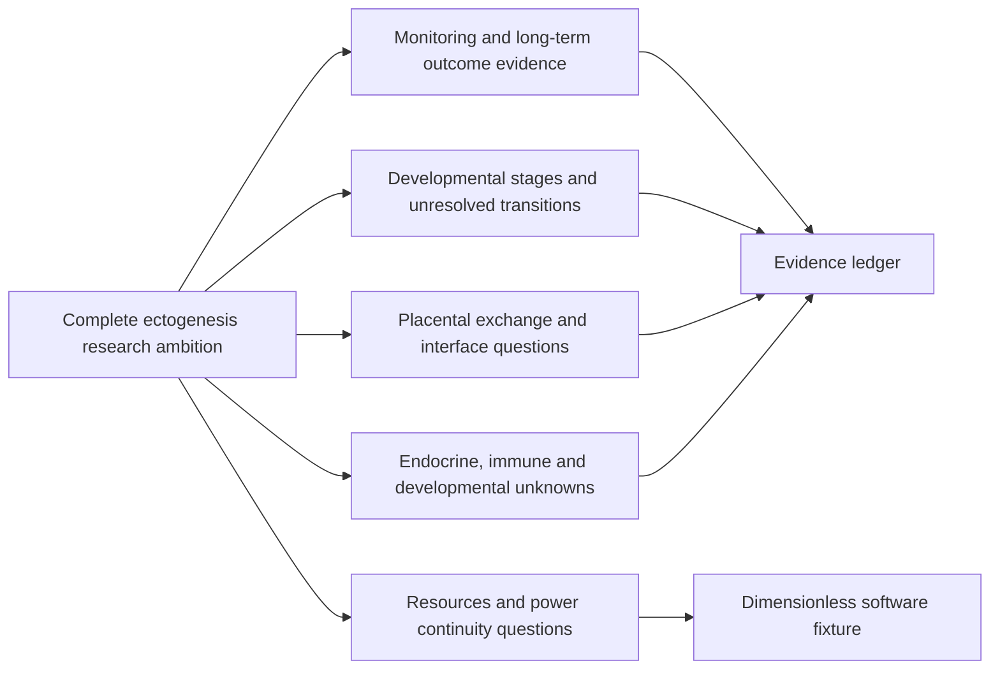

# Artificial womb models

An open research software project investigating **complete human ectogenesis: development from IVF through birth outside a human uterus**. A wall-powered artificial womb that could eventually remove the need for gestational surrogacy is the long-term ambition. The first release makes the evidence gaps inspectable and the software experiments reproducible.

The repository contains a reviewed stage/evidence map and an abstract exchange, backup-power and monitoring fixture. Its outputs measure software behavior. Complete human gestation, replacement of surrogacy and fewer congenital defects remain unassessed or undemonstrated in the evidence ledger reviewed on 2026-10-06.

## What you can run

Python 3.10+; the runtime has no third-party dependencies.

```powershell
python -m venv .venv
.venv\Scripts\python -m pip install -e .
.venv\Scripts\wombmodels evidence-report --ledger config/evidence.json --out artifacts/evidence-v1
.venv\Scripts\wombmodels simulate --config examples/exchange_fixture.json --out artifacts/exchange-v1
.venv\Scripts\wombmodels identifiability-report --config examples/exchange_fixture.json --trajectory artifacts/exchange-v1/trajectory.csv --out artifacts/identifiability-v1
.venv\Scripts\wombmodels design-sweep --config examples/exchange_fixture.json --out artifacts/design-sweep-v1 --replicates 8
.venv\Scripts\wombmodels desk-status --url http://127.0.0.1:8092
```

Each output destination must be new. Evidence reports include claims, a species-separated stage map, requirements, the original input and a receipt. Simulations include trajectories, balance residuals, synthetic sensor fault metrics, the original fixture configuration and a receipt. The identifiability report estimates two invented model rates from scheduled readings, surfaces design rank and condition, and reserves a later temporal segment. It ignores hidden simulated states; the later segment belongs to the same run and is not independent validation. Artifact formats are CSV, JSON and Markdown.

`design-sweep` compares three requested output-cadence factors with three sensor-noise multipliers using bounded seeded replicates (1–20 per design, within a four-million scheduled-sample budget). When monitor faults are configured, it also contrasts those intervals with a profile that removes injected monitor faults but retains wall outages and power-linked missing readings. Configurations with outages or monitor faults include a reflected event-timing profile that preserves interval lengths while moving events across the fixture timeline. `sweep_plan.json` records actual cadence/noise settings and the interval schedule for each timing profile. The report includes full-fit estimability, same-run temporal holdout residuals, condition numbers, fit residuals, and median/P90 recovery errors. A holdout fits the first 70% of usable intervals and scores only later intervals from that same generated run; it is an internal fixture diagnostic, not independent validation. Generator-known rates are used only after fitting for synthetic scoring. These replicates are software-method exploration, not biological sampling recommendations or independent experimental evidence.

The fixture has invented **dimensionless** stocks, rates, times and thresholds. It represents substrate conversion into waste, powered input and clearance, wall-power interruptions, finite backup reserve, and synthetic sensor bias/dropout. There is no conversion from its time coordinate into hours, gestational weeks or nine months. It computes no fetal physiology, development, probability of birth, machine-control action or biological safety rating.

## Developmental scope

| Research stage | First-release treatment |
| --- | --- |
| Preimplantation development | Explicit gap in this bounded source ledger |
| Implantation and placental interface formation | Unresolved stage and interface requirement |
| Postimplantation embryonic development | Mouse interval retained in mouse developmental notation |
| Partial support of an already-developed fetus | Ovine reports and intended human clinical scope kept separate |
| Transition into neonatal life | Separate from duration on support |
| Developmental and longer-term outcomes | Separate from physiological stability and survival |
| Continuous human IVF-to-birth gestation | Undemonstrated ambition in this ledger |

Different studies and species cannot be concatenated to claim a continuous gestation pathway. [EVIDENCE.md](EVIDENCE.md) describes source classes and the important adverse-growth finding; [METHODS.md](METHODS.md) gives the equations, boundaries and reproducibility contract.



This diagram organizes research questions; its arrows do not describe a demonstrated biological system or an assembly plan.

## ResearchDesk bridge

RegenWorkbench's `ectogenesis` blueprint provides normal source searches, evidence campaigns and dossier exports. This repository remains independently installable. `desk-status` makes one read-only request to the usual local `/api/state` endpoint and prints only the ectogenesis title, starter IDs and evidence-axis IDs. It accepts a numeric loopback HTTP(S) origin, disables proxies, refuses redirects, caps response size, and submits no jobs. Other notes and campaigns are neither printed nor written to disk.

A local ResearchDesk server can be inspected with the command above. Without that server, the offline artifact commands still work. The bridge is research organization and source discovery; it has no live control API. Synthetic exchange outputs are not registered as biological assays or `experiment.json` records.

When the sibling repos share the documented workspace layout, RegenWorkbench's `compose.research.yaml` mounts this repo's `artifacts/` directory read-only. Its ectogenesis **Model bench** checks receipt/source bindings, output byte counts and SHA-256 values, and displays evidence, simulation, identifiability and cadence/noise/fault/event-timing sweep reports; simulation cards can plot the sampled trace and modeled power states. Runtime fingerprints and limitations recorded in each report are visible beside its summary. A matching receipt establishes file integrity only; it does not review the claims or validate the model. Generate a new bundle under `artifacts/` and refresh the view to discover it.

## Development and verification

From the parent shared workspace:

```powershell
docker compose run --rm dev bash -lc 'cd /workspace/artificial-womb-models && PYTHONPATH=src python3 -W error::ResourceWarning -m unittest discover -s tests -v'
```

On a host with Python, after installing the package:

```powershell
python -W error::ResourceWarning -m unittest discover -s tests -v
```

The sensitivity and identifiability diagnostic asks whether scheduled measurements from this dimensionless fixture separate powered input from conversion. High parameter correlation, a poorly conditioned design, or weak later-interval fit expose ambiguity. These are diagnostics of software equations, not biological measurement design. [METHODS.md](METHODS.md) describes estimation and limits; [ROADMAP.md](ROADMAP.md) describes the research path.

The code is MIT licensed. Source papers retain their original rights; the ledger contains short attributed summaries and links, not redistributed article text or figures.
